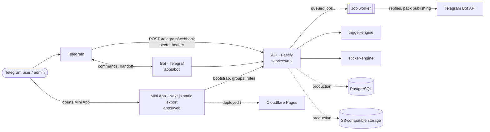
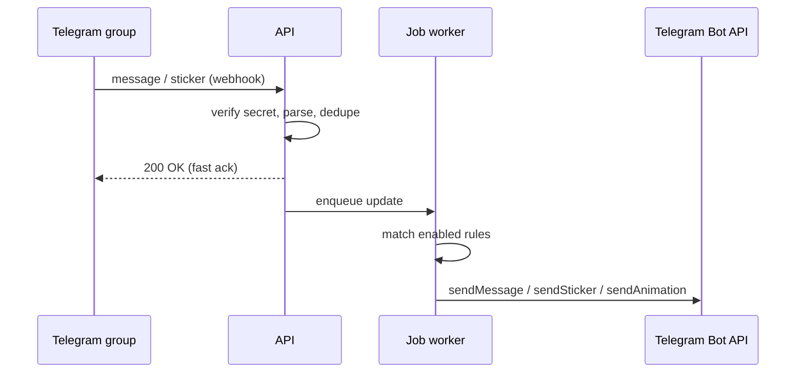

<p align="center">
  
</p>

<h1 align="center">STIXMΛGIC Telegram Platform</h1>

<p align="center"><b>Telegram bot + Mini App + shared API for sticker and emoji reaction automation</b></p>

<p align="center">
  <a href="https://github.com/FriskyDevelopments/stixmagic-web/actions/workflows/ci.yml"></a>
  <a href="https://github.com/FriskyDevelopments/stixmagic-web/actions/workflows/deploy-cf-production.yml"></a>
  
  
  
  
</p>

STIXMΛGIC is a Telegram-first reaction automation product. Group admins add the bot to a group, open the Mini App to create emoji or sticker rules, and the platform replies automatically with text, stickers, animations or inline-link buttons. This pnpm + Turborepo monorepo holds the **Telegram bot**, the **Next.js Mini App**, the **Fastify API** and the supporting sticker and trigger engines, all built on shared typed contracts. It is for the team building and operating STIXMΛGIC.

## MVP boundary

The MVP is a Telegram-first reaction automation loop:

1. Telegram sends a group message or sticker to `POST /telegram/webhook`.
2. The API discovers the group and queues the update idempotently.
3. An authenticated admin opens `/groups`, then creates an emoji or sticker rule.
4. The worker matches enabled rules and replies through the Telegram Bot API with text, a sticker, an animation, or an inline-link button.

The static Mini App uses `/group?groupId=...` and `/reactions?groupId=...` for live Telegram group IDs, so arbitrary groups work on Cloudflare Pages without requiring dynamic server-rendered routes.

Pack publishing, asset generation, PostgreSQL/S3 persistence, analytics, and non-Telegram adapters are outside the MVP boundary. See [`docs/product/mvp.md`](docs/product/mvp.md) for the acceptance checklist and runtime requirements.

This repository now treats the **Telegram bot**, **Telegram Mini App**, and the supporting API/services as one product system preparing for production.

Instead of “bot over here, web demo over there”, the repo is organized around two Telegram-facing surfaces that share one deployment story:

- **Bot surface** — the Telegram bot is the entry point, command layer, and automation runtime.
- **Mini App surface** — the Telegram Mini App is the operator console for groups, rules, and future deployment actions.
- **Shared platform layer** — typed contracts, environment strategy, API assumptions, and service topology used by both.

## Architecture



### Reaction rule lifecycle



## Stack

- pnpm workspaces + Turborepo, TypeScript throughout
- `apps/web`: Next.js, React, Tailwind CSS, Framer Motion (static export in `apps/web/out`)
- `apps/bot`: Telegraf
- `services/api`: Fastify, Zod, Nango (calendar integration), tests with `tsx --test`
- `services/sticker-engine`, `services/trigger-engine`: Fastify services
- Playwright end-to-end tests (`e2e/`), Docker Compose for local infra (`infra/docker`)

## Project structure

```text
apps/
  bot/              # Telegram bot runtime and Mini App handoff
  web/              # Next.js Telegram Mini App UI (+ public brand assets)
services/
  api/              # Shared Telegram + asset API (routes, jobs, auth, telegram)
  sticker-engine/   # Sticker processing service
  trigger-engine/   # Trigger execution service
packages/
  config/           # Shared env parsing + Telegram platform config builders
  types/            # Shared domain and Telegram contracts
  ui/               # Shared React UI components
e2e/                # Playwright specs
infra/              # Dockerfiles, docker-compose, production architecture notes
docs/               # architecture, product, roadmap, web docs
```

## Local development

```bash
# Install dependencies (pnpm 9)
pnpm install

# Copy the environment template
cp .env.example .env

# Start every surface and service in parallel (turbo)
pnpm dev

# Or run a single surface
pnpm --filter @stixmagic/web dev
pnpm --filter @stixmagic/bot dev
pnpm --filter @stixmagic/api dev

# Build, typecheck, lint and test across the monorepo
pnpm build
pnpm typecheck
pnpm lint
pnpm test

# Optional: full local stack with PostgreSQL and MinIO
docker compose -f infra/docker/docker-compose.yml up
```

## Environment variables

Names only, from `.env.example` and the code. Values are never committed.

**Runtime and ports**

- `NODE_ENV`
- `WEB_PORT`
- `API_PORT`
- `BOT_PORT`
- `STICKER_ENGINE_PORT`
- `TRIGGER_ENGINE_PORT`
- `ENABLE_JOB_WORKER`

**Storage**

- `POSTGRES_URL`
- `S3_ENDPOINT`
- `S3_REGION`
- `S3_BUCKET`
- `S3_ACCESS_KEY`
- `S3_SECRET_KEY`

**Telegram**

- `TELEGRAM_BOT_TOKEN`
- `TELEGRAM_BOT_USERNAME`
- `TELEGRAM_MINI_APP_URL`
- `TELEGRAM_BOT_MODE`
- `TELEGRAM_WEBHOOK_SECRET`
- `ADMIN_TELEGRAM_USER_ID`

**Shared URLs**

- `STIXMAGIC_PUBLIC_WEB_URL`
- `STIXMAGIC_API_BASE_URL`

**Mini App build (public)**

- `NEXT_PUBLIC_STIXMAGIC_PUBLIC_WEB_URL`
- `NEXT_PUBLIC_STIXMAGIC_API_BASE_URL`
- `NEXT_PUBLIC_STIXMAGIC_BOT_USERNAME`
- `NEXT_PUBLIC_STIXMAGIC_MINI_APP_URL`
- `NEXT_PUBLIC_STIXMAGIC_MANIFEST_URL`
- `NEXT_PUBLIC_STIXMAGIC_USE_DEMO_DATA`
- `NEXT_PUBLIC_STIXMAGIC_ALLOW_API_FALLBACK`

**LORE module**

- `LORE_MEMBER_INVITE_SECRET`
- `LORE_PUBLIC_URL`
- `LORE_DEFAULT_TENANT_ID`
- `LORE_ALLOW_DEV_IDENTITY`
- `LORE_ALLOW_ADMIN_INVITE_PREVIEW`
- `LORE_EMAIL_WEBHOOK_URL`
- `LORE_PRIVATE_COMMUNITY_URL`

**Integrations**

- `NANGO_API_KEY`
- `NANGO_HOST`
- `NANGO_GOOGLE_CALENDAR_INTEGRATION_ID`
- `NANGO_WEBHOOK_SIGNING_KEY`

## Deploy

**Mini App (web):** GitHub Actions builds `apps/web` as a static export (`apps/web/out`) and deploys it to **Cloudflare Pages**: `main` goes to production (`deploy-cf-production.yml`), while `preview`/`dev` branches and PRs get preview deployments (`deploy-cf-preview.yml`). Build with the production `NEXT_PUBLIC_STIXMAGIC_*` values, and point `TELEGRAM_MINI_APP_URL` at the deployed Mini App route.

**Bot:** long-running service. In production use `TELEGRAM_BOT_MODE=webhook` behind a stable HTTPS ingress.

**API:** shared by the bot and the Mini App. Both must point at the same `STIXMAGIC_API_BASE_URL` / `NEXT_PUBLIC_STIXMAGIC_API_BASE_URL`.

**Supporting services:** `sticker-engine` and `trigger-engine` stay as backends for asset processing and trigger execution. A real deployment needs PostgreSQL and S3-compatible storage. Container builds live in `infra/docker/` and the target topology is in [`infra/deploy/production-architecture.md`](infra/deploy/production-architecture.md).

## What was unified

### 1) Shared Telegram platform config
Both the bot and mini app now derive from one naming and env strategy:

- `STIXMAGIC_API_BASE_URL`
- `STIXMAGIC_PUBLIC_WEB_URL`
- `TELEGRAM_BOT_USERNAME`
- `TELEGRAM_MINI_APP_URL`
- `TELEGRAM_BOT_MODE` (`polling` or `webhook`)
- `TELEGRAM_WEBHOOK_URL` (required when using webhook mode)

The web app uses corresponding build-time variables:

- `NEXT_PUBLIC_STIXMAGIC_API_BASE_URL`
- `NEXT_PUBLIC_STIXMAGIC_PUBLIC_WEB_URL`
- `NEXT_PUBLIC_STIXMAGIC_BOT_USERNAME`
- `NEXT_PUBLIC_STIXMAGIC_MINI_APP_URL`
- `NEXT_PUBLIC_STIXMAGIC_MANIFEST_URL`
- `NEXT_PUBLIC_STIXMAGIC_USE_DEMO_DATA`

### 2) Shared Telegram contracts
`@stixmagic/types` now includes shared Telegram-facing contracts for:

- bot runtime mode
- platform config payloads
- mini app bootstrap/context payloads
- reaction rule creation payloads

### 3) Shared API assumptions
The API now exposes Telegram-oriented endpoints that the mini app can use directly:

- `GET /telegram/platform`
- `GET /telegram/mini-app/bootstrap`
- `GET /groups`
- `GET /groups/:groupId`
- `GET /groups/:groupId/rules`
- `POST /groups/:groupId/rules`
- `PATCH /groups/:groupId/rules/:ruleId`
- `DELETE /groups/:groupId/rules/:ruleId`

This replaces the previous “mostly mock UI with implied backend” split with a clearer shared contract.

### 4) Bot-to-mini-app handoff
The bot now:

- presents the mini app as the primary control surface
- uses a shared mini app URL and bot links
- supports explicit runtime mode configuration for `polling` vs `webhook`
- keeps Telegram commands aligned with the mini app instead of pointing to parallel flows

### 5) Demo mode is explicit
The mini app no longer quietly depends on missing env vars to decide behavior.

Demo data is now an explicit build-time choice:

- `NEXT_PUBLIC_STIXMAGIC_USE_DEMO_DATA=true` → UI uses seeded scaffold data
- `false` → UI expects the shared API surface and fails fast if API/bootstrap/auth requests fail

Optional fallback behavior can still be turned on explicitly per environment:

- `NEXT_PUBLIC_STIXMAGIC_ALLOW_API_FALLBACK=true` → allows fallback to seeded data when live API requests fail
- Keep `NEXT_PUBLIC_STIXMAGIC_ALLOW_API_FALLBACK=false` in production so failures are visible and actionable

## Backend hardening status

Recent backend work delivered a production-safe foundation for Telegram-facing trust and processing boundaries:

- Telegram Mini App init-data is now verified server-side before returning bootstrap data.
- Admin operations now require authenticated Telegram identity and explicit admin authorization.
- Telegram webhook ingestion now validates secret headers, parses typed updates, and handles duplicates idempotently.
- Heavy trigger/sticker workflows are now acknowledged quickly and executed via durable queued jobs.
- Sticker pack publishing now integrates with real Telegram Bot API methods for pack creation and sticker addition.

## Recommended next steps

1. Swap the current file-backed persistence layer with PostgreSQL connection pooling in production deployments.
2. Add per-route rate limiting and structured audit logging for admin actions.
3. Add dead-letter and metrics around the job worker loop.
4. Expand Telegram update handling coverage beyond message/sticker payloads.

## Docs

- [`infra/deploy/production-architecture.md`](infra/deploy/production-architecture.md)
- [`docs/architecture/api-design.md`](docs/architecture/api-design.md)
- [`docs/architecture/event-flow.md`](docs/architecture/event-flow.md)
